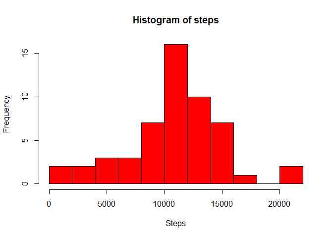
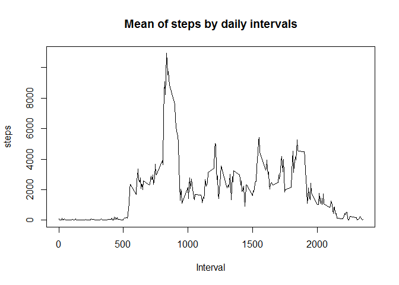
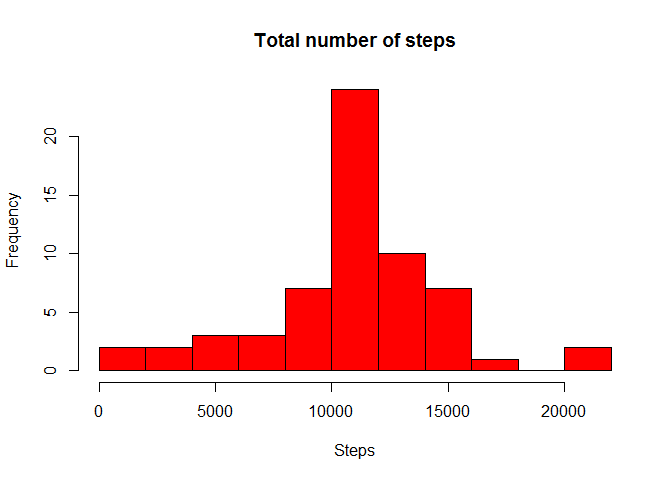
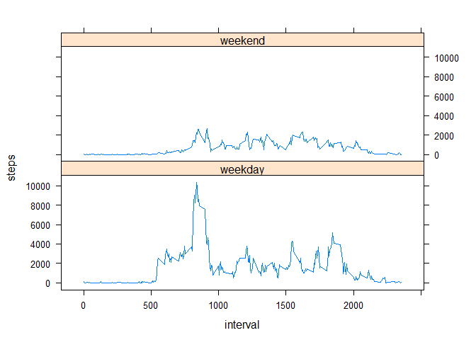

# Reproducible Research: Peer Assessment 1
## Introduction

This assignment makes use of data from a personal activity monitoring devices such as a Fitbit, Nike Fuelband, or Jawbone Up. These devices collects data at 5 minute intervals through out the day. The data consists of two months of data from an anonymous individual collected during the months of October and November, 2012 and include the number of steps taken in 5 minute intervals each day

## Data

The data for this assignment is the dataset [Activity monitoring data](https://d396qusza40orc.cloudfront.net/repdata%2Fdata%2Factivity.zip) which it was downloaded from from the course web site.

The variables included in this dataset are:

- steps: Number of steps taking in a 5-minute interval (missing values are coded as NA)
- date: The date on which the measurement was taken in YYYY-MM-DD format
- interval: Identifier for the 5-minute interval in which measurement was taken

The dataset is stored in a comma-separated-value (CSV) file and there are a total of 17,568 observations in this dataset.

## Loading and preprocessing the data

The dataset was loaded y preprocesed to remove the NA values with the following code:


```r
library(dplyr)
```

```
## 
## Attaching package: 'dplyr'
## 
## The following object is masked from 'package:stats':
## 
##     filter
## 
## The following objects are masked from 'package:base':
## 
##     intersect, setdiff, setequal, union
```

```r
ract <- read.csv("activity.csv")

act <- filter(ract, !is.na(ract$steps)) 
```


## What is mean total number of steps taken per day?

The total number of steps for day is calculated and plotted an histogram


```r
library(plyr)
```

```
## -------------------------------------------------------------------------
## You have loaded plyr after dplyr - this is likely to cause problems.
## If you need functions from both plyr and dplyr, please load plyr first, then dplyr:
## library(plyr); library(dplyr)
## -------------------------------------------------------------------------
## 
## Attaching package: 'plyr'
## 
## The following objects are masked from 'package:dplyr':
## 
##     arrange, count, desc, failwith, id, mutate, rename, summarise,
##     summarize
```

```r
sms <- aggregate(act$steps ~ act$date, act, sum)
sms <- plyr::rename(sms,replace=c("act$date"="date", "act$steps"="steps"))
sn <- sms$steps

hist(sn, breaks=10, xlab="Steps", main="Histogram of steps",freq=T, col="red")
```

 

Mean total number of steps taken per day


```r
mean(sn)
```

```
## [1] 10766.19
```

Median total number of steps taken per day


```r
median(sn)
```

```
## [1] 10765
```

## What is the average daily activity pattern?

Time series plot of the 5-minute interval.


```r
itv <- aggregate(act$steps ~ act$interval, act, sum)
itv <- plyr::rename(itv,replace=c("act$interval"="interval","act$steps"="steps"))

plot(itv$interval, itv$steps, type="l", xlab="Interval", ylab="steps", main="Mean of steps by daily intervals") 
```

 

5-minute interval with the maximum number of steps


```r
mxs <- max(itv$steps)
filter(itv, itv$steps == mxs)
```

```
##   interval steps
## 1      835 10927
```


## Imputing missing values

Total number of missing values in the dataset


```r
nrow(ract) - nrow(act)
```

```
## [1] 2304
```

Filling in all of the missing values in the dataset with the mean for each 5-minute interval

The variable *itm* contains the mean of steps for each interval rounded to integer, in *atma* the value *itm*
is replicated 61 times, this number is the quotient obtained by dividing num rows in the file (*ract*) by
the numbers of intervals per day (288) .

The funtion *repna* replace the NA values in steps by the mean calcualted for each interval. The update steps 
values are stored in the variable *stpi*.


```r
repna <- function (x, v) {
        y <- NULL
        for (i in 1:length(x)) {
                if (is.na(x[i])) {
                        y[i] <- v[i]               
                } else {
                        y[i] <- x[i]
                }
        }
        y
}

ti <- nrow(ract)/288
itm <- aggregate(act$steps ~ act$interval, act, mean)
itm <- plyr::rename(itm,replace=c("act$interval"="interval","act$steps"="steps"))
itm$steps <- round(itm$steps)
itma <- rep(itm$steps, times = ti)
stpi <- repna(ract$steps, itma)
```
Create a new dataset that is equal to the original dataset but with the missing data filled in.
In the new dataset (*nact*) the column steps was replaced with the values of *stpi* created previously.


```r
nact <- data.frame(steps=stpi, date=ract$date,interval=ract$interval)
write.csv(nact,"activity.new.csv" )
```
Histogram of the total number of steps taken each day ()


```r
nsms <- aggregate(nact$steps ~ nact$date, nact, sum)
nsms <- plyr::rename(nsms,replace=c("nact$date"="date", "nact$steps"="steps"))
nsn <- nsms$steps

hist(nsn, breaks=10, xlab="Steps", main="Total number of steps",freq=T, col="red")
```

 

Mean of total number of steps taken per day


```r
mean(nsn)
```

```
## [1] 10765.64
```
Median of total number of steps taken per day

```r
median(nsn)
```

```
## [1] 10762
```

Conclusion: about comparing the histogram, mean, ans median with and without NA:

**- Both new mean and median are in the same range of previous mean and median**

**- Observing the second histogram, it is clear that the impact is low, both histograms are similar,
 only some values are changed**


## Are there differences in activity patterns between weekdays and weekends?

Create new factor variable (wl in code) in the dataset with two levels – “weekday” and “weekend”
whether a given date is a weekday or weekend day.

Because echa day has 288 intervals, two variables had been created *wkd* and *wke* that contains the values
"weekday" and "weekend" respectively.
The variable *ti* calculated before it is the number of days each one with 288 intervals.
The for loop pint to firs interval in each day and create a vector *vl* that contains wkd or wke for echa day depending on the day is weekday or weekend.


```r
library(lubridate)
```

```
## 
## Attaching package: 'lubridate'
## 
## The following object is masked from 'package:plyr':
## 
##     here
```

```r
wd <- NULL
wl <- NULL
wkd <- rep("weekday", times=288)
wke <- rep("weekend", times=288)
for (i in 1:ti) {
        k = (i-1)*288 + 1 
        dd <- as.character(nact$date[k])
        wd <- wday(nact$date[k])
        if (wd > 1 & wd < 7) {
                wl <- c(wl, wkd)
        } else {
                wl <- c(wl, wke)
        }
}
acto <- data.frame(steps=nact$steps, date=nact$date, interval=nact$interval, daylevels=wl)
```

Make a panel plot containing a time series plot of the 5-minute interval (x-axis) and the average 
number of steps taken, averaged across all weekday days or weekend days (y-axis).


```r
library(lattice)
swd <- dplyr::filter(acto, acto$daylevels=="weekday" )
swe <- dplyr::filter(acto, acto$daylevels=="weekend" )
itvd <- aggregate(swd$steps ~ swd$interval, swd, sum)
itve <- aggregate(swe$steps ~ swe$interval, swe, sum)
itvd <- plyr::rename(itvd,replace=c("swd$interval"="interval","swd$steps"="steps"))
itve <- plyr::rename(itve,replace=c("swe$interval"="interval","swe$steps"="steps"))
itvd["daylevels"] <- wkd
itve["daylevels"] <- wke
itvn <- rbind(itvd, itve)

xyplot(steps ~ interval | itvn$daylevel, data=itvn, layout=c(1, 2), type="l")
```

 
